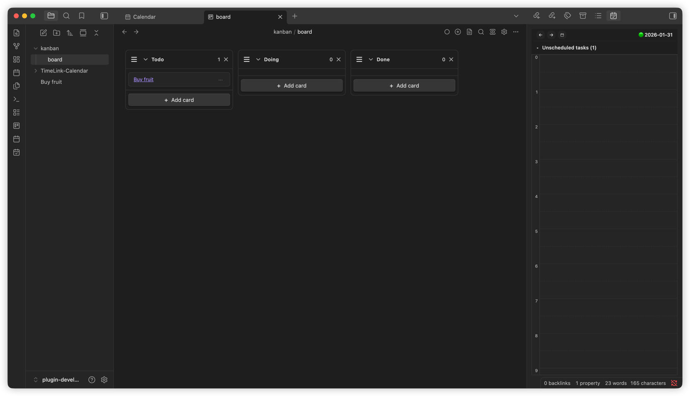
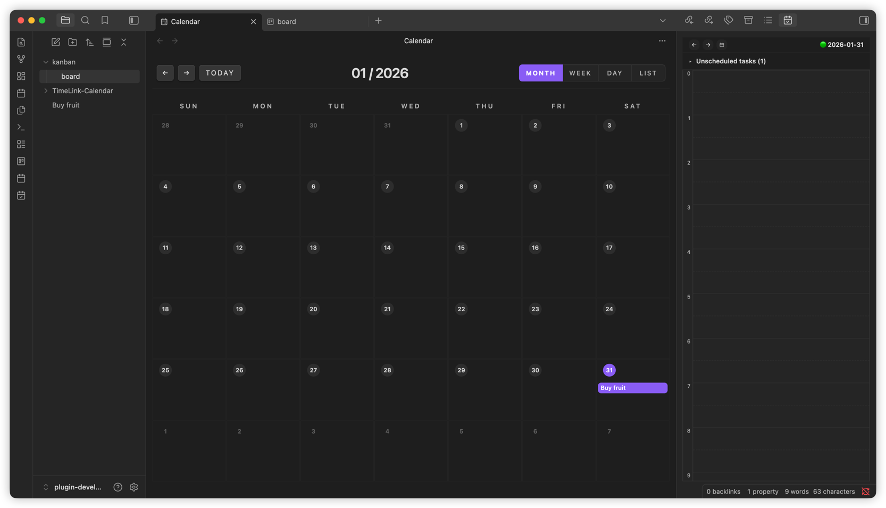
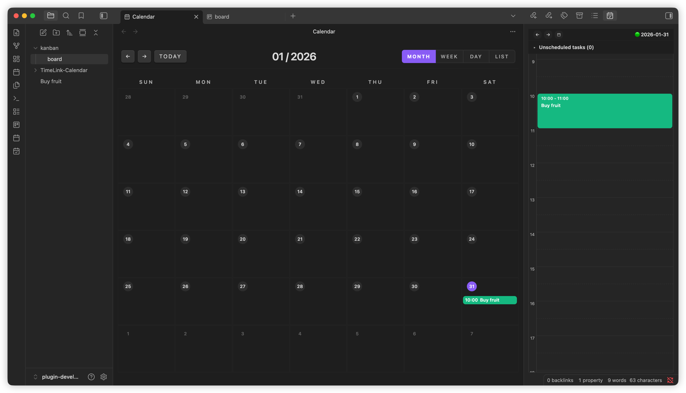
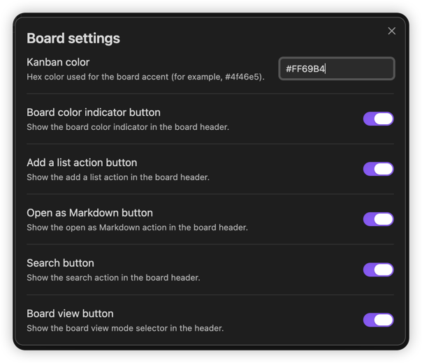
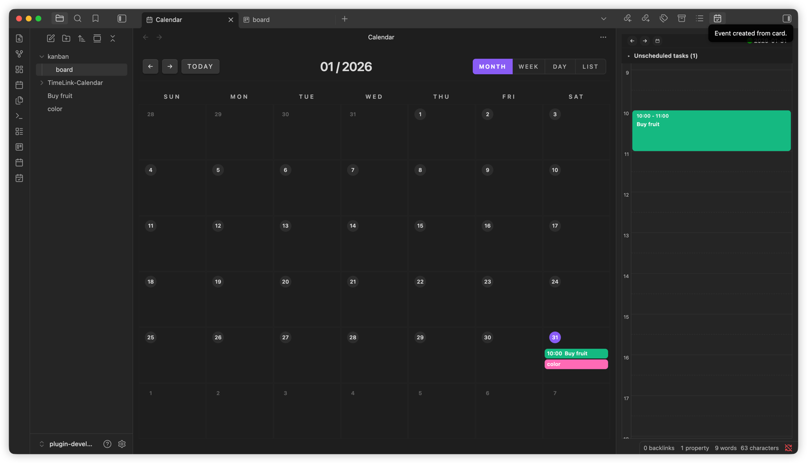

# TimeLink

TimeLink is an Obsidian community plugin that connects a calendar, timeline, and kanban board in one place. It is designed to keep your tasks and events as linked notes without breaking your flow.

Organize your to-do list with a kanban board and turn events written on the board into calendar items for schedule management. Use the timeline to manage tasks in detail and wrap up your day cleanly.

This plugin is inspired by features from reference plugins, and adds per-board (category) color assignments so you can separate tasks more clearly in the calendar and timeline.

## Key features

- Calendar: Create event notes and manage them by date.
- Timeline: View events along a chronological flow.
- Kanban board: Manage work on a board and link cards with event notes.
- Board colors: Assign category colors to distinguish tasks in calendar/timeline views.
- Link automation: Events created from cards link back to their cards.

## Screenshots

### Kanban board

### Calendar

### Color settings and timeline panel

### Default kanban board color

### Board color applied → Calendar event inherits board color

## Getting started

1. **Open from the ribbon**
   - Calendar: calendar ribbon icon
   - Timeline: timeline ribbon icon
   - Kanban: kanban ribbon icon

2. **Open from the command palette**
   - **Open timeline**
   - **Create kanban board**
   - **Open active kanban board**

3. **Create a board from a folder menu**
   - File explorer → right-click a folder → **New kanban board**

## Workflow

### Kanban card → Create event

- From a kanban card menu, select **Create event from card**.
- A card note and an event note are created and linked.

### Link behavior

- Cards include links to their card notes.
- Event notes include links back to the card.

## Settings

- **Enable kanban**: Turn kanban board features on or off.
- **Calendar folder**: Set the folder where calendar event notes are stored.

## Tips

- Create the calendar folder in advance to keep event notes organized.
- The timeline is based on calendar events.
- If you do not need kanban, disable **Enable kanban** to simplify the UI.

## References

This plugin was built with inspiration from the following Obsidian plugins:

- https://github.com/mgmeyers/obsidian-kanban
- https://github.com/obsidian-community/obsidian-full-calendar
- https://github.com/ivan-lednev/obsidian-day-planner

## License

0-BSD
