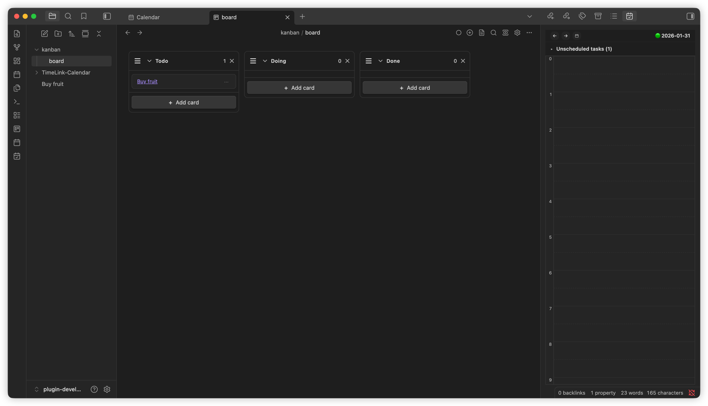
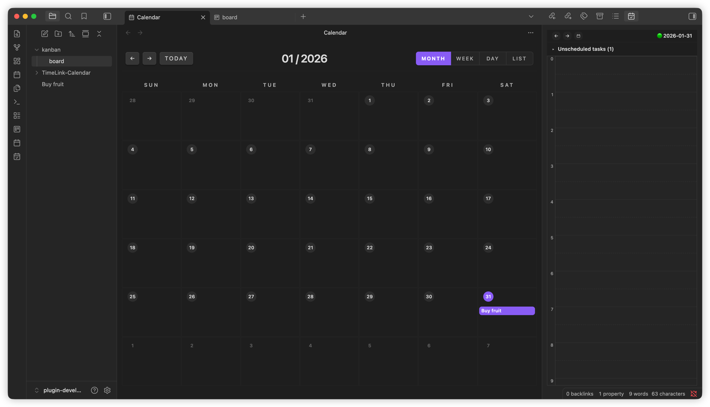
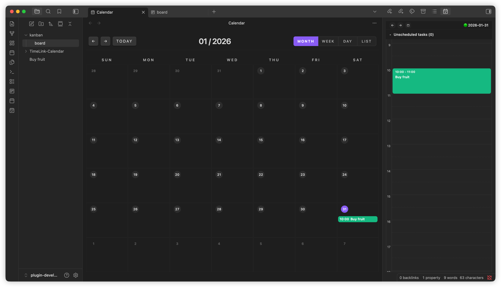
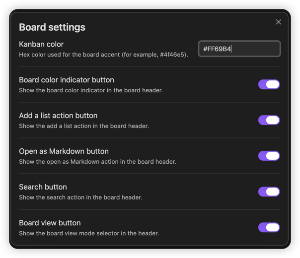
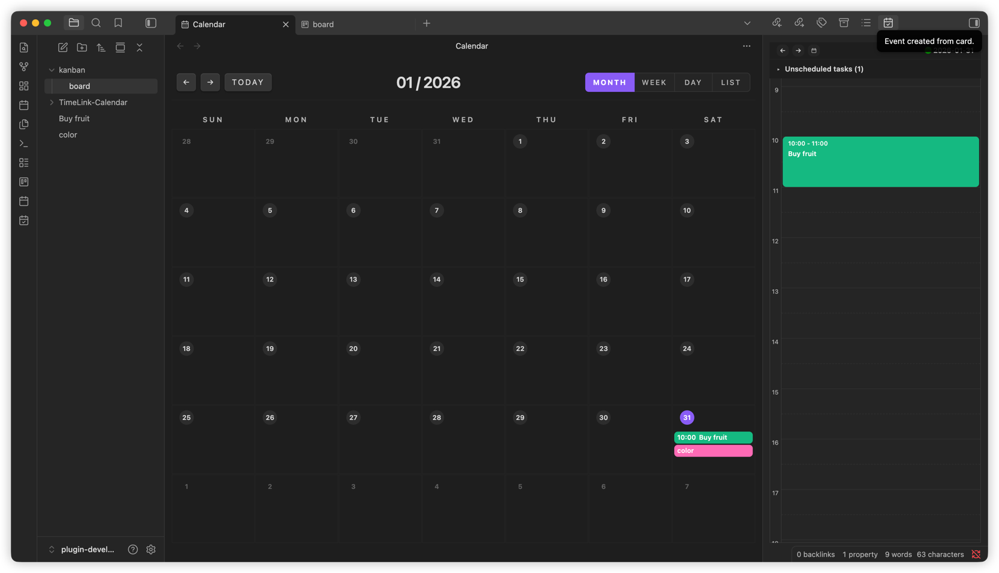

# TimeLink

TimeLink is an Obsidian community plugin that connects a calendar, timeline, kanban workflow, and board-level schedule overview in one place.

It is built for linked-note workflows: create notes from cards, create events from cards, keep backlinks in sync, and review dated work from daily views up to a board-wide Gantt overview.

## What TimeLink includes

- **Calendar view**: Create and manage event notes by date.
- **Timeline view**: Review timed and unscheduled work in chronological order.
- **Kanban board view**: Manage tasks on boards, open markdown files as kanban boards, and add lists from the command palette.
- **Kanban list view**: Browse kanban boards in your vault and refresh the board index from one place.
- **Gantt view**: See dated kanban-linked events grouped by board in a year-based overview with a quick jump back to today.
- **Board colors**: Apply per-board colors and reuse them in linked event displays.
- **Linked note and event automation**: Create note/event links from cards and keep backlinks between cards and event notes in sync.
- **Linked cleanup on card deletion**: Optionally remove the linked note and linked event when deleting a card.

## Screenshots

### Kanban board



### Calendar



### Timeline and board color settings



### Default kanban board color



### Board color applied to linked calendar events



## Getting started

1. **Open the main views**
   - Calendar: **Open calendar** ribbon icon
   - Timeline: **Open timeline** ribbon icon or **Open timeline** command
   - Kanban list: **Open kanban list** ribbon icon when kanban is enabled
   - Gantt: **Open gantt** ribbon icon when kanban is enabled

2. **Create or open kanban boards**
   - Ribbon: **Create kanban board**
   - Command palette: **Create kanban board**
   - File explorer folder menu: **New kanban board**
   - Markdown file menu: **Open as kanban board**
   - Command palette on an active markdown note: **Open active kanban board**

3. **Manage board structure**
   - Command palette inside an active kanban board: **Add a list**

## Typical workflow

### Card to note

- Use **New note from card** to create a linked markdown note from a kanban card.
- Use **Copy link to card** to copy a direct link back to the card.

### Card to event

- Use **Create event from card** in the card menu.
- TimeLink creates or reuses the linked card note, creates the event, and writes backlinks between the card note and event note.

### Board-level planning

- Assign a board color to visually group related work across kanban, calendar, timeline, and linked events.
- Open **Kanban list** to scan boards in the vault.
- Open **Gantt** to review dated kanban-linked events grouped by board and jump directly back to today.

### Safe cleanup

- When deleting a card, you can choose whether the linked note should also be removed.
- If the card is linked to an event, TimeLink can remove the linked note and linked event together.

## Settings

- **Enable kanban**: Enable or disable kanban, kanban list, and gantt-related features.
- **Calendar folder**: Choose the folder where calendar event notes are stored.

## Development

```bash
npm install
npm run lint
npm test
npm run build
```

The automated test suite runs on Vitest and includes structure guards for the calendar, timeline, kanban, kanban-list, gantt, and shared layers.

## References

TimeLink is inspired by ideas from these Obsidian plugins:

- https://github.com/mgmeyers/obsidian-kanban
- https://github.com/obsidian-community/obsidian-full-calendar
- https://github.com/ivan-lednev/obsidian-day-planner

## License

0-BSD
